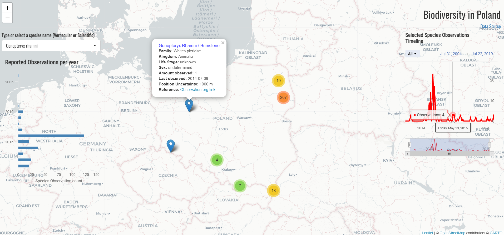

## README

- **About the app**

Shiny Application for Appsilon interview. The app is available at: https://michalis-zouvelos.shinyapps.io/Poland_Biodiversity/

The application uses biodiversity data from [GBIF organization](https://www.gbif.org/occurrence/search?dataset_key=8a863029-f435-446a-821e-275f4f641165)
The app let the user explore the biodiversity of Poland and the observation occurrences of the species.

- **How to use**

The app allows the user to type or select a species by their name (either scientific or vernacular) and displays the observations on the map. The app also displays a bar chart with the total yearly observations of the selected species and a timeline graph of the number of recorded observations for each day they occurred, displaying the exact date of the observations. The app also displays information regarding each observation with a popup label window when the user selects one of the pinned observations on the map.

- **Creating the app**

The data were loaded using a Spark database connection since the initial file with data for the whole world
was large and then only the data for Poland were extracted into a distinct csv file.

The code used to load the data is located: [here](https://github.com/mzouvelos/Poland_biodiversity_appsilon/blob/main/R/Load.R)

For the images which are displayed on the popup label rvest package was used to scrape the relevant 
images url's from the observations website if the observer provided an image along with their report.

The code used to scrape the images is located: [here]()

The map was created using the leaflet package and highcharter for the graphs.

The code used to create the app is located: [here](https://github.com/mzouvelos/Poland_biodiversity_appsilon/blob/main/R/app.R)